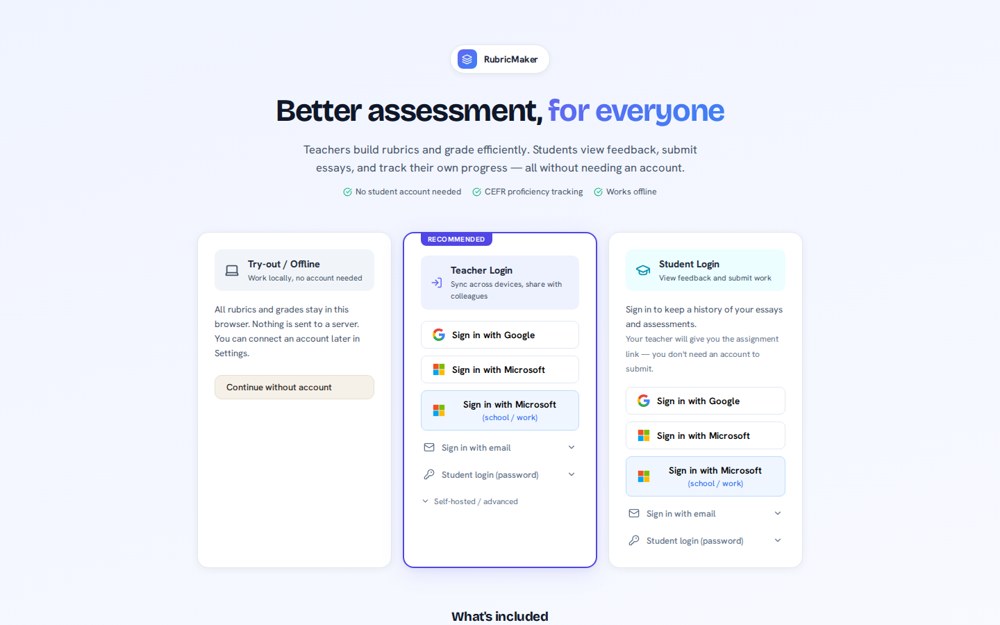
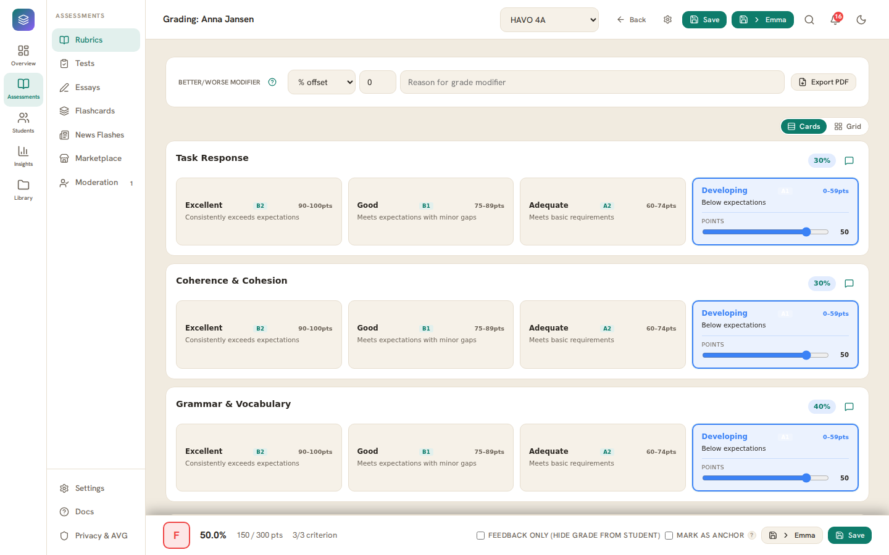
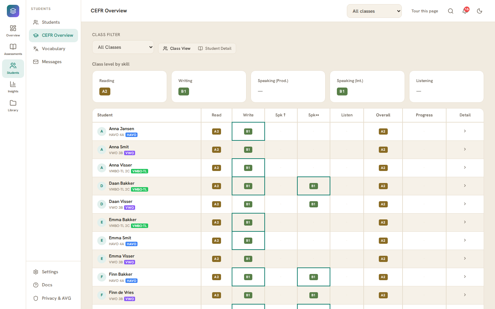
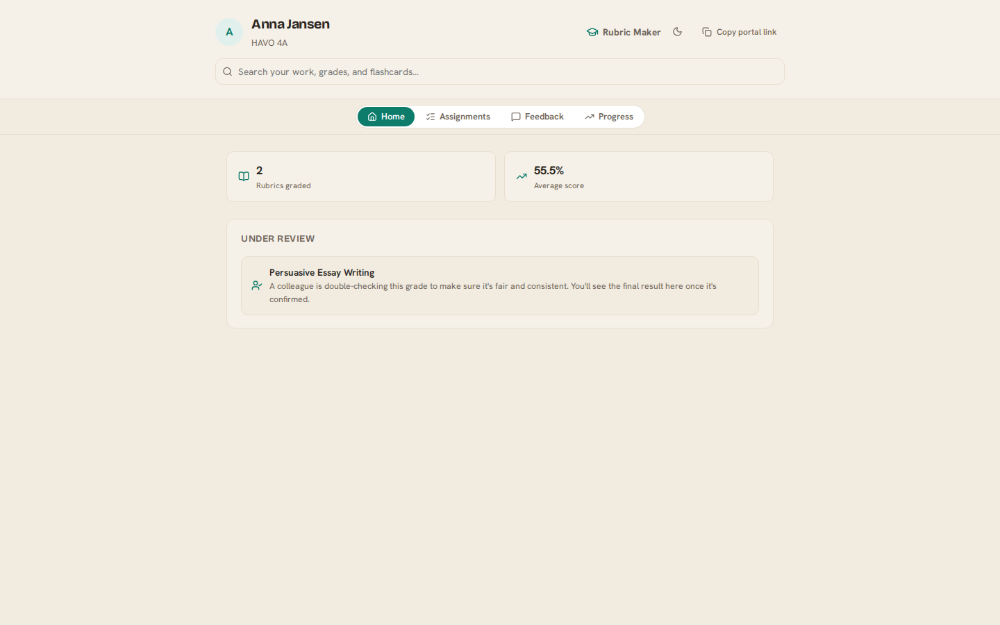
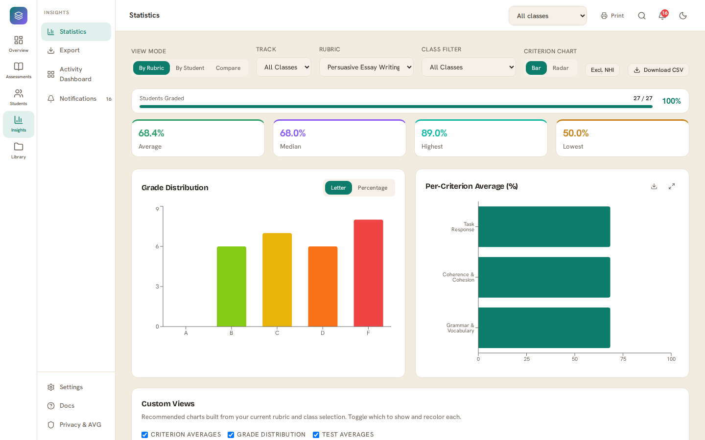

# Rubric Maker

[](https://github.com/NesiciCoding/RubricMaker/actions/workflows/ci.yml)
[](https://github.com/NesiciCoding/RubricMaker/actions/workflows/codeql.yml)
[](https://github.com/NesiciCoding/RubricMaker/actions/workflows/lighthouse.yml)
[](https://github.com/NesiciCoding/RubricMaker/actions/workflows/ci.yml)
[](LICENSE)
[](https://nesicicoding.github.io/RubricMaker/)

[](https://react.dev)
[](https://www.typescriptlang.org)
[](https://vite.dev)
[](https://supabase.com)
[](https://github.com/NesiciCoding/RubricMaker/wiki/Getting-started)
[](https://github.com/NesiciCoding/RubricMaker/wiki/Features)

<p align="center">
  
</p>

A comprehensive rubric creation and grading tool built with React and TypeScript — self-hostable with full functionality, and offline-capable (with reduced capabilities) when no backend is configured. Designed for educators who need to design complex rubrics, grade students efficiently, and analyse performance — including language proficiency tracking aligned to the Common European Framework of Reference (CEFR).

> 🚀 **Try it now** — the [live demo](https://nesicicoding.github.io/RubricMaker/) runs entirely in your browser. No account, no install, no backend.

---

## Contents

- [Quick start](#quick-start)
- [How to read this README](#how-to-read-this-readme)
- [Features](#features)
- [Screenshots](#screenshots)
- [Documentation](#documentation)
- [Development 🧑‍💻](#development)
- [Tech stack 🧑‍💻](#tech-stack)
- [Deployment](#deployment)
- [Developer reference 🧑‍💻](#developer-reference)
- [Contributing & security 🧑‍💻](#contributing--security)

---

## Quick start

Pick the path that fits:

| You want to…                                    | Do this                                                                                        |
| ----------------------------------------------- | ---------------------------------------------------------------------------------------------- |
| **Try it immediately**                          | Open the [live demo](https://nesicicoding.github.io/RubricMaker/) — data stays in your browser |
| **Run it locally** (no backend)                 | The three commands below; everything works in `localStorage`                                   |
| **Run the full stack** (Docker + Supabase sync) | [Jump to the Docker quick start](#option-a-docker-full-stack)                                  |

**Run locally (3 commands):**

```bash
git clone https://github.com/NesiciCoding/RubricMaker.git
cd RubricMaker
npm install
npm run dev
```

Open [http://localhost:5173](http://localhost:5173). No backend or account is required — without one, all data lives in the browser's local storage.

---

## How to read this README

This document is the landing page, not the manual. Everything below is organised by audience — start where you belong and follow the links for depth.

| Reader                                               | Start with                                                                                                                                      |
| ---------------------------------------------------- | ----------------------------------------------------------------------------------------------------------------------------------------------- |
| **Teachers & educators** — you want to use the app   | [Features](#features), then the [user documentation wiki](https://github.com/NesiciCoding/RubricMaker/wiki)                                     |
| **Students** — you use the student portal            | [Student Portal wiki page](https://github.com/NesiciCoding/RubricMaker/wiki/Student-Portal)                                                     |
| **School IT / admins** — you deploy and operate it   | [Deployment](#deployment) → [Installation wiki](https://github.com/NesiciCoding/RubricMaker/wiki/Installation)                                  |
| **Developers** — you build or contribute to the code | [Development](#development) → [Tech stack](#tech-stack) → [Developer reference](#developer-reference) → [Contributing](#contributing--security) |

Sections marked 🧑‍💻 in the contents are written for developers — if you're here to _use_ Rubric Maker, you can skip them entirely.

---

## Features

The full, illustrated feature documentation lives in the [Features wiki page](https://github.com/NesiciCoding/RubricMaker/wiki/Features) (with screenshots). Here is the one-glance overview:

| Area                           | What you can do                                                                                                                                                                                                                                                                                                                                                                                                                                                      |
| ------------------------------ | -------------------------------------------------------------------------------------------------------------------------------------------------------------------------------------------------------------------------------------------------------------------------------------------------------------------------------------------------------------------------------------------------------------------------------------------------------------------- |
| **Rubric builder**             | Flexible criteria and performance levels; three scoring modes (total points, weighted percentage, single-point); sub-item checklists, point ranges and score modifiers; link criteria to CCSS/NGSS/Dutch kerndoelen standards, CEFR Can-Do descriptors, IB Learner Profile or Bloom's Taxonomy; grammar tagging; automatic versioning with restore.                                                                                                                  |
| **Tests & quizzes**            | Twelve question types (multiple-choice, multiple-response, true/false, short answer, open, fill-the-gap, matching, ordering, categorize, hot text, audio-response, …); rich-text prompts with inline images and click-to-insert gap pills; per-question standards/CEFR links; class assignments with unique share links, due dates, optional Safe Exam Browser, and grade scales.                                                                                    |
| **Practice & placement**       | Practice mode (listening, reading, grammar) that never affects graded results; three adaptive placement engines — multistage routing, staircase (A2→C2 ladder), and a generator that pulls questions live from your question bank (filtered by CEFR range, skill — the five CEFR skills plus grammar — and tag, and drawing whole reading/listening section bundles as well as standalone questions) with Elo ordering — each producing a provisional CEFR estimate. |
| **Grading**                    | Click/level/slider scoring in a card or compact grid layout; keyboard shortcuts (1–5, A+1, …); score modifiers with a reason; voice-graded comments; a taggable comment bank with smart suggestions; group grading, comparative side-by-side grading, peer review with reviewer analytics, and self-assessment; co-grading with an independent second marking and a moderation queue for disputes.                                                                   |
| **Essays**                     | Standalone essay assignments with prompts, rubric links, word/time limits and live monitoring; a distraction-free student focus mode; rich-text TipTap editor; anonymous submission codes; OCR (Tesseract.js) and DOCX parsing for uploaded documents; inline anchored comments on submissions.                                                                                                                                                                      |
| **Flashcards**                 | Anki-style decks scheduled with the FSRS spaced-repetition algorithm; vocabulary decks with phonetic/part-of-speech fields and grammar decks that feed grammar practice; import from CSV/XLSX/DOCX/TXT; assign to classes and inspect per-student learning insights; students can create their own decks and share them read-only with a teacher.                                                                                                                    |
| **CEFR & language assessment** | Per-student and whole-class proficiency overviews (Reading, Writing, Speaking, Listening) benchmarked against track/year expected ranges; structured speaking sessions; rule-based learning paths and intervention flags; a grammar mastery profile merging test, flashcard and writing evidence; optional Cambridge English exam mapping.                                                                                                                           |
| **Vocabulary profiling**       | A rule-based (no-AI) CEFR vocabulary profiler over analysed documents: per-class/student level distribution, off-list share and academic-word (AWL/NAWL) coverage; a "right for my class?" target-level verdict on any text; export word lists by band or seed a flashcard deck from them.                                                                                                                                                                           |
| **Student portal**             | Unique shareable link per student (no login needed): grades, teacher comments and files, a combined to-do list, essays and tests, flashcard study, self-assessment, portal search, and messaging with the teacher.                                                                                                                                                                                                                                                   |
| **Analytics**                  | Statistics dashboard with grade distributions, per-criterion breakdowns, and multi-class comparison with an insights panel; an activity dashboard (rubric × test × essay × class grid); vocabulary profile dashboards; per-student profiles with portfolios; overdue tracking.                                                                                                                                                                                       |
| **Export**                     | PDF reports (individual or class); Word (.docx) with mail-merge and style templates; CSV with ready-made Magister/SOMtoday gradebook presets; aggregated period reports; per-student report cards; essay exports (Markdown/DOCX/PDF); calendar (.ics) exports.                                                                                                                                                                                                       |
| **Collaboration**              | A school marketplace to publish/clone rubrics, tests, decks and bank items; one-toggle department sharing of live rubrics; live test/essay monitoring with proctoring flags; batch grading-task assignment to colleagues; student messaging and a notification center.                                                                                                                                                                                               |
| **Accessibility**              | WCAG 2.1 AA (axe-core audits in CI); dyslexia-friendly reading mode; six theme bundles; in-app Joyride tours; global search (`Ctrl`/`Cmd`+`K`) with filter tokens.                                                                                                                                                                                                                                                                                                   |

**Offline-first, cloud-ready:** the core grading workflow (rubrics, grading, statistics, flashcards) works fully offline with data in `localStorage`. Connecting an optional [Supabase](https://supabase.com) backend unlocks everything that needs a shared server — cross-device sync, multi-teacher collaboration, the student portal, messaging, notifications and the marketplace. If Supabase is configured but unavailable, the app continues with the reduced-capability `localStorage` fallback rather than failing.

---

## Screenshots

<table>
  <tr>
    <td width="50%"></td>
    <td width="50%"></td>
  </tr>
  <tr>
    <td><em>Interactive grading — click levels, slider scoring, comment bank, keyboard shortcuts</em></td>
    <td><em>Per-student and whole-class CEFR overview, benchmarked by track and year</em></td>
  </tr>
  <tr>
    <td width="50%"></td>
    <td width="50%"></td>
  </tr>
  <tr>
    <td><em>The student portal — grades, to-dos, essays, flashcards, and messaging</em></td>
    <td><em>Statistics dashboard with grade distributions, per-criterion breakdowns, and multi-class comparison</em></td>
  </tr>
</table>

More illustrated walkthroughs — including manual captures of live-service features — are on the [wiki](https://github.com/NesiciCoding/RubricMaker/wiki).

---

## Documentation

**User documentation (wiki):** [Home](https://github.com/NesiciCoding/RubricMaker/wiki) · [Getting started](https://github.com/NesiciCoding/RubricMaker/wiki/Getting-started) · [Features](https://github.com/NesiciCoding/RubricMaker/wiki/Features) · [Tests & Practice](https://github.com/NesiciCoding/RubricMaker/wiki/Tests-and-Practice) · [Flashcards](https://github.com/NesiciCoding/RubricMaker/wiki/Flashcards) · [Student Portal](https://github.com/NesiciCoding/RubricMaker/wiki/Student-Portal) · [Supabase Sync](https://github.com/NesiciCoding/RubricMaker/wiki/Supabase-Sync) · [FAQ](https://github.com/NesiciCoding/RubricMaker/wiki/FAQ)

**Deployment & operations (repo `docs/`):**

- [HestiaCP setup](docs/HESTIACP_SETUP.md) — shared hosting / cPanel-style VPS
- [Virtualmin setup](docs/VIRTUALMIN_SETUP.md) — Virtualmin VPS deployment
- [Observability on a HestiaCP subdomain](docs/OBSERVABILITY_HESTIACP.md) — Loki/Promtail/Grafana behind a dedicated HTTPS subdomain
- [Grafana dashboards](docs/OBSERVABILITY_DASHBOARDS.md) — what the provisioned dashboards show and how to customize them
- [Magister integration](docs/MAGISTER_INTEGRATION.md) — importing students from Magister SIS
- [Self-hosting operations](docs/SELF_HOSTING_OPS.md) — backup/restore, upgrades, resource sizing, pg_cron setup, troubleshooting
- [Branch protection & production environment](docs/BRANCH_PROTECTION.md) — recommended required CI checks for `main` and required reviewers for production deploys

---

## Development

To run the project locally:

1. **Install dependencies:**

    ```bash
    npm install
    ```

2. **Start the development server:**

    ```bash
    npm run dev
    ```

3. Open [http://localhost:5173](http://localhost:5173) in your browser.

**Other useful commands:**

```bash
npm run check        # Full pre-push gate: typecheck + lint + format + unit tests
npm run typecheck    # TypeScript check (run before commits)
npm run lint         # ESLint
npm run test         # Vitest unit tests
npm run coverage     # Coverage report
npm run e2e          # Playwright end-to-end tests

# Supabase local dev (optional)
npm run db:start     # Start local Supabase stack
npm run db:reset     # Reset and re-apply all migrations

# Backend load testing (k6) against a local Supabase stack (needs `npm run db:start`).
# Reads Supabase keys automatically; profiles: smoke | load | stress | spike | soak.
npm run loadtest              # default 'load' profile (~50 VUs)
npm run loadtest:stress       # climb VUs to find the breaking point
```

New to the codebase? See the [Development Guide](https://github.com/NesiciCoding/RubricMaker/wiki/Development-Guide) and [Architecture](https://github.com/NesiciCoding/RubricMaker/wiki/Architecture) wiki pages.

---

## Tech stack

| Layer              | Choice                                                                  |
| ------------------ | ----------------------------------------------------------------------- |
| UI                 | React 19 + TypeScript, built with Vite 8                                |
| Styling            | Plain CSS + Radix UI primitives                                         |
| Rich-text editing  | TipTap (ProseMirror)                                                    |
| Backend & sync     | Supabase (optional — Postgres, auth, storage, realtime, edge functions) |
| Spaced repetition  | `ts-fsrs` (FSRS algorithm)                                              |
| Unit testing       | Vitest                                                                  |
| End-to-end testing | Playwright                                                              |
| CI / CD            | GitHub Actions (CI, CodeQL, Lighthouse, e2e, deployments)               |

---

## Deployment

RubricMaker works in two modes:

- **Offline-only** — data lives in the browser's local storage. No server needed. Works on GitHub Pages, SharePoint, or any static host.
- **With database sync** — add an optional Supabase backend for multi-device sync, email login, and rubric sharing between teachers. Hosted on your own infrastructure.

> Deploying for a school? Read the [Installation wiki page](https://github.com/NesiciCoding/RubricMaker/wiki/Installation) first — it walks through the choices end to end.

### Option A: Docker (full stack)

The easiest way to run the full stack. Requires [Docker](https://docs.docker.com/get-docker/).

**Your own laptop or school LAN:**

```bash
cp .env.docker.example .env   # defaults work as-is for localhost
docker-compose up -d --build
```

Open [http://localhost:8080](http://localhost:8080). To make it accessible to other teachers on the network, set `SITE_URL=http://<your-ip>:8080` in `.env` first.

**VPS with a domain name (HTTPS):**

```bash
cp .env.docker.example .env
# Edit .env:
#   DOMAIN=rubricmaker.school.nl
#   SITE_URL=https://rubricmaker.school.nl
#   JWT_SECRET=<random 64-char string>   ← change this!
#   POSTGRES_PASSWORD=<strong password>  ← change this!
docker-compose --profile https up -d --build
```

Caddy obtains a free Let's Encrypt certificate automatically. Open ports 80 and 443 on your firewall.

**Enabling email login (OTP):**

Without SMTP, teachers log in anonymously. To allow email-linked accounts:

```bash
# In .env:
MAILER_AUTOCONFIRM=false
SMTP_HOST=smtp.office365.com   # or smtp.gmail.com, smtp-relay.brevo.com
SMTP_USER=rubricmaker@school.nl
SMTP_PASS=your-app-password

docker-compose up -d --force-recreate auth
```

Teachers receive an 8-digit sign-in code by email. The bundled GoTrue config sends a code-only template (`public/email-templates/otp-code.html`) with no clickable confirmation link — some email security scanners (e.g. Microsoft Safe Links) automatically open links in incoming mail, which would consume the one-time token before the teacher can enter the code, causing "Token has expired or is invalid" errors.

**Student login without email:** many schools' spam filters block or delay Supabase's default OTP sender, leaving students unable to sign in. As an alternative, a teacher can generate a password for any student with an email on file (Students page → key icon on that student's row) and share it with them directly — the student then signs in at the landing page with "Student login (password)". This depends on the `set-student-password` edge function, which requires a functions runtime in front of an API gateway — **this repo's own docker-compose.yml does not include one**, so this feature (and the DB-backed essay submission flow, which relies on `submit-essay`/`get-essay-assignment` the same way) only works when Supabase is provided by the [official self-hosted Supabase Docker stack](https://supabase.com/docs/guides/self-hosting/docker) (which ships a `functions` container behind Kong) or Supabase Cloud. On the official stack, deploy by copying the function's `index.ts` straight into that stack's `volumes/functions/set-student-password/index.ts` — there's no separate "deploy" step; the edge-runtime serves it as soon as the file is in place.

**Backup and restore:**

```bash
./scripts/backup.sh              # saves to ./backups/YYYYMMDD_HHMMSS/
./scripts/restore.sh backups/20260515_120000
```

**Updating to a new version:**

```bash
git pull
docker-compose up -d --build    # rebuilds the app image, restarts services
# Migrations run automatically on next startup
```

### Option B: Static hosting (offline mode only)

No database sync — all data stays in the browser. Works on any static host.

**Build:**

```bash
npm run build   # output in dist/
```

Deploy the `dist/` folder to GitHub Pages, Vercel, Netlify, or any web server.

**SharePoint:**

1. Run `npm run build`
2. In `dist/`, rename `index.html` → `index.aspx`
3. Upload the entire `dist/` folder to a SharePoint Document Library
4. Click `index.aspx` to launch

> For Standards Integration on SharePoint, add the SharePoint domain to your Common Standards Project API key's allowed origins.

### Operational guides

The deep operational detail is in the [self-hosting docs](docs/SELF_HOSTING_OPS.md). Highlights:

- **Nightly attachment cleanup (recommended):** attachment files and their DB rows are deleted automatically when they age past the owner's school retention period (default: 7 years). Schedule the bundled script with `crontab -e`: `0 2 * * * cd /path/to/rubricmaker && ./scripts/delete-old-attachments.sh >> /var/log/rubricmaker-cleanup.log 2>&1`. The script uses the Storage HTTP API (it does **not** delete rows directly from `storage.objects`, which Supabase blocks) and treats a 404 from storage as success so orphaned DB rows are always removed. On Supabase Cloud, schedule the `delete-old-attachments` edge function instead (Supabase Dashboard → Edge Functions).
- **Nightly cloud backup (recommended for Supabase Cloud / the official self-hosted stack):** `scripts/backup.sh` above only works against this repo's own `docker-compose.yml` (it runs `docker-compose exec db pg_dump` against a hardcoded volume name). For Cloud or a separately self-hosted Supabase, use the `nightly-backup` edge function instead: it dumps each teacher/admin's rows via `public.export_owner_backup()` and uploads a JSON snapshot to the private `backups` Storage bucket (7 most recent per user), scheduled via Supabase Dashboard → Edge Functions or a `pg_cron` + `pg_net` job. Note this is a disaster-recovery snapshot of raw table rows — restoring means re-inserting the rows directly (e.g. via `psql`), not importing through the app's own Settings → Backup & Restore; and it's metadata only, so back up the `essays`/`recordings`/`attachments` buckets separately if you need the files themselves recoverable.
- **Teacher email digest (optional, `pg_cron`-driven):** the `scheduled-digest` edge function emails opted-in teachers nightly about pending moderation disputes, overdue grading, or unread student messages (same three sources as the in-app Notification Center). It needs a functions runtime plus one-time per-deployment settings (`app.settings.project_url` / `app.settings.service_role_key` via `ALTER DATABASE …`) before it can send anything — see [docs/SELF_HOSTING_OPS.md](docs/SELF_HOSTING_OPS.md) for the full `pg_cron`/`pg_net` setup.
- **Stress-test logging (optional):** set `VITE_STRESS_TEST_LOGGING=true` in `.env` (requires migrations `035_client_logs.sql` and `072_client_logs_observability.sql`, included with `db:reset`/`docker-compose db_migrate`) to log user actions, sync results, JS errors, pageviews and Web Vitals (LCP/FCP/FID/CLS + page load) to a `client_logs` table — never free-text content. Unset and rebuild after the stress-test window.
- **Observability (optional, for pilot/stress-test windows):** a standalone Loki + Promtail + Grafana stack (`docker-compose -f docker-compose.observability.yml --env-file .env.observability up -d`, Grafana on `http://localhost:3001`) filters web-server and container logs, and can query `client_logs` **and the whole Supabase schema** via a Postgres datasource. Set `GRAFANA_ADMIN_PASSWORD` to a strong value in `.env.observability` — the stack refuses to start without it (no default credentials). See [Observability on a HestiaCP subdomain](docs/OBSERVABILITY_HESTIACP.md) and [Grafana dashboards](docs/OBSERVABILITY_DASHBOARDS.md) for remote HTTPS access and what each dashboard shows.
- **Backend load testing (optional):** the k6 harness (`npm run loadtest`, see [`k6/README.md`](k6/README.md)) drives configurable virtual-user load at the Supabase backend. Run it against a local stack for regression smoke, or against a VM sized to a school's server to find its concurrency ceiling — [docs/LOAD_TESTING_STAGING.md](docs/LOAD_TESTING_STAGING.md) covers the staging-VM workflow and per-school sizing.

---

## Developer reference

> 🧑‍💻 This section is for contributors — teachers and admins can stop here.

### Routes

| Path                                        | Page                                                                                                                                             |
| ------------------------------------------- | ------------------------------------------------------------------------------------------------------------------------------------------------ |
| `/`                                         | Dashboard                                                                                                                                        |
| `/rubrics`                                  | Rubric list                                                                                                                                      |
| `/rubrics/new`                              | New rubric                                                                                                                                       |
| `/rubrics/:id`                              | Rubric builder                                                                                                                                   |
| `/rubrics/:rubricId/grade/:studentId`       | Grade a student                                                                                                                                  |
| `/rubrics/:rubricId/peer-review/:studentId` | Peer review view                                                                                                                                 |
| `/peer-analytics/:rubricId`                 | Peer review analytics (consistency, feedback heatmap, reviewer trends)                                                                           |
| `/rubrics/:rubricId/self-assess/:studentId` | Student self-assessment                                                                                                                          |
| `/essays`                                   | Essay list                                                                                                                                       |
| `/essays/new`                               | New essay                                                                                                                                        |
| `/essays/:teacherKey`                       | Essay builder (prompt, rubric link, assign students, import submissions)                                                                         |
| `/essays/:assignmentId/monitor`             | Live essay monitor (presence, live word counts, draft preview)                                                                                   |
| `/speaking/:rubricId/:studentId`            | Speaking session                                                                                                                                 |
| `/grade-comparative/:classId/:rubricId`     | Comparative grading                                                                                                                              |
| `/marketplace`                              | School marketplace for rubrics, tests, flashcard decks, and question bank items (browse, publish, clone, upvote)                                 |
| `/tests`                                    | Test list                                                                                                                                        |
| `/tests/new`                                | New test                                                                                                                                         |
| `/tests/:id`                                | Test builder                                                                                                                                     |
| `/tests/:testId/results/:studentTestId`     | Test results, manual grading, and class-average adjustment                                                                                       |
| `/tests/:testId/monitor`                    | Live test monitor (presence, response grid, proctoring flags)                                                                                    |
| `/students`                                 | Students list                                                                                                                                    |
| `/students/:id`                             | Student profile                                                                                                                                  |
| `/students/:id/cefr-overview`               | Per-student CEFR overview                                                                                                                        |
| `/students/:id/learning-path`               | Per-student learning path — rule-based rubric recommendations and intervention flags                                                             |
| `/cefr-overview`                            | Whole-class CEFR overview                                                                                                                        |
| `/vocabulary`                               | Vocabulary Profile dashboard (CEFR vocabulary distribution per class/student, CSV export)                                                        |
| `/flashcards`                               | Flashcard deck list                                                                                                                              |
| `/flashcards/:id`                           | Flashcard deck editor — cards, CSV/XLSX/DOCX import, class assignment, per-student insights                                                      |
| `/news-flashes`                             | News flashes — curate articles/books/videos to share with students                                                                               |
| `/portal/:studentId`                        | Student portal (public) — grades, to-do list, self-assessment, pending co-grading moderation notices, learning-path/grammar recommendations      |
| `/portal/:studentId/flashcards/:deckId`     | Student flashcard study session (spaced repetition)                                                                                              |
| `/feedback/:code`                           | Student feedback view (public, no login — decodes a shared grade-summary link)                                                                   |
| `/preview/:code`                            | Rubric preview (public, no login — decodes a shared rubric link, no student data)                                                                |
| `/essay/:code`                              | Essay writing session (public, no login — decodes a shared essay-assignment link)                                                                |
| `/test/:code`                               | Take a test (public, no login — answer questions, optional timer, submit)                                                                        |
| `/attachments`                              | Attachment manager                                                                                                                               |
| `/comments`                                 | Comment bank                                                                                                                                     |
| `/question-bank`                            | Question bank — reusable test questions, insertable into any test                                                                                |
| `/statistics`                               | Statistics dashboard (by-rubric, by-student, multi-class compare with insights)                                                                  |
| `/activity-dashboard`                       | Activity Dashboard — rubric/test/essay × class grid with link/assign/reorder actions, pending grading-task list                                  |
| `/moderation`                               | Moderation queue — disputed co-graded submissions, per-criterion delta, keep/accept resolution                                                   |
| `/messages`                                 | Messages inbox — reply to or start a thread with a portal-authenticated student                                                                  |
| `/notifications`                            | Notification Center — full, filterable history of overdue grading, unread messages, and pending moderation reviews, with cross-device dismissals |
| `/export`                                   | Export page                                                                                                                                      |
| `/settings`                                 | Settings                                                                                                                                         |
| `/admin`                                    | Admin panel (admin role only)                                                                                                                    |
| `/privacy`                                  | Privacy statement                                                                                                                                |

### Key utility modules

| File                                    | Purpose                                                                                                                                                                                                        |
| --------------------------------------- | -------------------------------------------------------------------------------------------------------------------------------------------------------------------------------------------------------------- |
| `src/utils/gradeCalc.ts`                | Score aggregation and weighted scoring engine                                                                                                                                                                  |
| `src/utils/cefrStudentAggregator.ts`    | CEFR level computation across assessments                                                                                                                                                                      |
| `src/utils/cefrVocabularyProfiler.ts`   | CEFR vocabulary profiler over a validated 64k-word index (`src/data/cefrLevels.ts`): level distribution, estimated level, off-list share, academic coverage; builds/reads the persisted per-document profile   |
| `src/utils/academicWordList.ts`         | Academic Word List (AWL) + NAWL membership and coverage over a token list                                                                                                                                      |
| `src/utils/textLevelVerdict.ts`         | Target-level "right for my class?" verdict: coverage %, above-target words, and a suitable/slightly-above/too-hard label, from a text or an aggregated distribution                                            |
| `src/utils/vocabProfileAggregator.ts`   | Per-student and per-class CEFR vocabulary aggregation (level distribution, off-list and AWL/NAWL shares) and the vocabulary-list CSV export                                                                    |
| `src/utils/placementRouting.ts`         | Section-routing engine for staged placement tests (threshold scoring, next-section resolution, cycle detection)                                                                                                |
| `src/utils/placementResult.ts`          | Deterministic provisional CEFR estimate from a completed placement test's section path                                                                                                                         |
| `src/utils/placementStaircase.ts`       | Staircase (adaptive-ladder) placement engine: level progression, next-question resolution, and item-level Elo self-calibration/rating bands per CEFR level                                                     |
| `src/utils/placementGenerator.ts`       | Types/predicate for the Generator placement engine, which pulls questions live from the question bank at runtime via the `next-placement-question` edge function instead of a pre-authored pool                |
| `src/utils/eloProgressAggregator.ts`    | Builds a student's Elo-scaled CEFR progression across placement-test attempts, for the Statistics placement-progress chart                                                                                     |
| `src/utils/learningGoalsAggregator.ts`  | Learning goal progress tracking                                                                                                                                                                                |
| `src/utils/docxExport.ts`               | DOCX generation via `docx` library                                                                                                                                                                             |
| `src/utils/docxTemplateExport.ts`       | Mail-merge DOCX with field substitution                                                                                                                                                                        |
| `src/utils/exportDataPrep.ts`           | Shared filename sanitization, points-range formatting, and HTML-comment stripping used by the DOCX/PDF export paths                                                                                            |
| `src/utils/docxStyleTemplate.ts`        | Extracts heading/body font from an uploaded .docx for essay/period-report style templates                                                                                                                      |
| `src/utils/pdfExport.ts`                | PDF report generation                                                                                                                                                                                          |
| `src/utils/textExtraction.ts`           | OCR (Tesseract) + DOCX parsing (Mammoth); also DOCX→HTML conversion for the read-only grading document view                                                                                                    |
| `src/utils/essayShareCode.ts`           | Shareable codes for essay access (no auth needed)                                                                                                                                                              |
| `src/utils/pinHash.ts`                  | PIN hashing for student self-assessment locks                                                                                                                                                                  |
| `src/utils/clozeParse.ts`               | Parses `{{...}}` cloze gap syntax and `[[...]]` hot-text fragment syntax for test questions                                                                                                                    |
| `src/utils/audioResponseCode.ts`        | Encodes/parses the data-URI JSON carried in an `audio-response` question's `TestAnswer.response`                                                                                                               |
| `src/utils/testQuestionClone.ts`        | Regenerates a test question's id and every nested option/pair/item id, and instantiates a fresh copy of a Question Bank item (single question or reading/listening section bundle) ready to insert into a test |
| `src/utils/masteryProfileAggregator.ts` | Merges per-student test accuracy, flashcard FSRS state, and graded-writing scores into one row per grammar item                                                                                                |
| `src/utils/learningPathAggregator.ts`   | Rule-based rubric recommendations, intervention flagging, and grammar practice recommendations                                                                                                                 |
| `src/utils/testSummaryAggregator.ts`    | Per-question/per-skill strong-weak test breakdown                                                                                                                                                              |
| `src/utils/reportCardAggregator.ts`     | Composes CEFR, learning-goals, and test-summary data into one report card                                                                                                                                      |
| `src/utils/globalSearch.ts`             | Token-aware search (`type:`/`class:`/`year:`/`track:` filters, student+rubric grading shortcut) across rubrics, tests, students, classes, essays, flashcard decks, and news flashes                            |
| `src/utils/portalSearch.ts`             | Student-portal search over a student's own graded rubrics, work (tests/essays), and flashcard decks                                                                                                            |
| `src/utils/statsChartPresets.ts`        | Recommended chart definitions for the Statistics "Custom Views" gallery                                                                                                                                        |
| `src/utils/coGradingModerationQueue.ts` | Flags disputed co-graded submissions (delta above threshold) for the Moderation queue                                                                                                                          |
| `src/utils/flashcardScheduler.ts`       | Thin wrapper around `ts-fsrs` (FSRS spaced repetition): rating, study queue, interval preview                                                                                                                  |
| `src/utils/flashcardImport.ts`          | Flashcard import from CSV (papaparse), XLSX (read-excel-file), DOCX (mammoth), and plain text                                                                                                                  |
| `src/utils/questionBankImport.ts`       | Bulk Question Bank import from a JSON file (plain questions or section bundles, all `TestQuestionType`s, CEFR/grammar/standard links, tags, optional Elo rating)                                               |
| `src/utils/flashcardInsights.ts`        | Learner insights per deck: stage counts, due cards, focus words from FSRS state                                                                                                                                |
| `src/utils/displayOrder.ts`             | Shared sort/reorder helpers for manually-orderable list views                                                                                                                                                  |
| `src/utils/cohortAggregator.ts`         | Derives a cohort's student set from current + past class memberships by year/track                                                                                                                             |
| `src/utils/gradebookExportPresets.ts`   | Per-SIS CSV column presets (Magister, SOMtoday) for the gradebook export                                                                                                                                       |
| `src/utils/testExportPresets.ts`        | Whole-class test results CSV: one row per student, overall score plus per-question and per-skill accuracy columns                                                                                              |
| `src/utils/icsExport.ts`                | Builds a minimal `.ics` calendar file from assignment deadlines                                                                                                                                                |
| `src/utils/messageThreads.ts`           | Groups flat student/teacher `Message` rows into threads by student + context                                                                                                                                   |
| `src/services/standardsApi.ts`          | Common Standards Project API (CCSS, NGSS)                                                                                                                                                                      |
| `src/services/freeDictionaryApi.ts`     | Keyless word lookup (definition, phonetic, part of speech) via the Free Dictionary API (`dictionaryapi.dev`) for the vocabulary panel                                                                          |

---

## Contributing & security

- [Contributing guide](https://github.com/NesiciCoding/RubricMaker/wiki/Contributing) — how to report issues, propose changes, and open pull requests
- [Development Guide](https://github.com/NesiciCoding/RubricMaker/wiki/Development-Guide) — codebase conventions and workflow
- [Roadmap](https://github.com/NesiciCoding/RubricMaker/wiki/Roadmap) — where the project is heading
- [Security policy](SECURITY.md) — responsible disclosure
- [Privacy statement](PRIVACY.md) — what the app collects and stores, and when it stays fully local

> **License:** [MIT](LICENSE) — free to use, modify and distribute, with attribution. See the [LICENSE](LICENSE) file for details.
